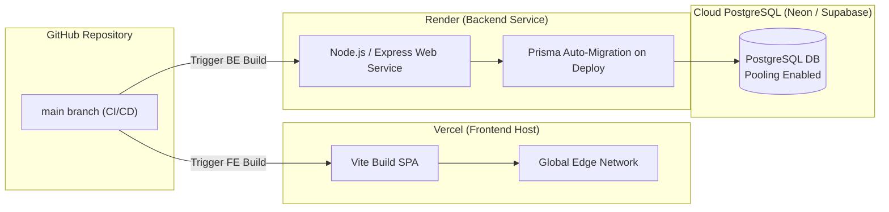

# System & Application Architecture — EMI App

## 1. Executive Summary & Design Goals
The **EMI App** application is structured with a clean separation of concerns across a multi-tier architecture. It enforces strict boundary discipline between HTTP routing, validation, business logic, persistence, and external presentations.

Key Architectural Principles:
1. **Layered Decoupling**: Business rules reside exclusively in the Service layer (`Routes -> Middleware -> Controllers -> Services -> Repositories -> Prisma -> PostgreSQL`).
2. **Financial Math Integrity**: All financial computations (EMI breakdown, interest calculations, total payable) are strictly executed on the server using authoritative database data.
3. **Feature-Oriented Frontend**: Customer and Admin frontend experiences are built using React 18, TypeScript, Tailwind CSS, and TanStack Query.
4. **Resilient Server State & URL Sync**: Server state managed via TanStack Query; selection state synchronized in URL parameters.
5. **Architectural Decision Records (ADRs)**: Important engineering choices documented under `docs/decisions/`.

---

## 2. Defensible System Architecture

```
                           EMI APP
                            │
             ┌──────────────┴──────────────┐
             │                             │
         CUSTOMER                       ADMIN
             │                             │
       React + TS                    React + TS
             │                             │
       TanStack Query                Protected routes
             │                             │
             └──────────────┬──────────────┘
                            │
                      REST API / v1
                            │
                ┌───────────┴───────────┐
                │                       │
          Public APIs              Admin APIs
                │                       │
                └───────────┬───────────┘
                            │
                     Middleware Layer
                            │
               ┌─────────────┴─────────────┐
               │                           │
           Validation                     Auth
               │                           │
               └─────────────┬─────────────┘
                            │
                       Controllers
                            │
                         Services
                            │
                      Repositories
                            │
                         Prisma
                            │
                       PostgreSQL
```

---

## 3. High-Level Domain Model Architecture

```
Brand ───┐
         │
Category ├── Product
         │     │
         │     └── ProductVariant
         │             │
         │       ┌─────┼─────────┐
         │       │     │         │
         │    Images Specs   EMIPlans
         │                         │
         │                    EMIProvider
         │
         └─────────────────────────────┐
                                       │
                                 EMIApplication
                                       │
                                  AuditLog
```

### Responsibility Contracts

| Layer | Responsibility | What it MUST NOT do |
|---|---|---|
| **Routes** | Define paths (`/api/v1/...`), attach middleware chain, attach controllers. | Perform inline validation or call services directly. |
| **Middleware** | Intercept requests for CORS, Helmet security headers, JWT validation, Zod payload validation, and error formatting. | Execute business rules or commit database transactions. |
| **Controllers** | Parse HTTP inputs (`req.params`, `req.query`, `req.body`), delegate to Services, format HTTP responses (`200 OK`, `201 Created`). | Execute SQL/Prisma queries, perform EMI math, or return raw stack traces. |
| **Services** | Implement domain logic (e.g., verifying variant existence, checking EMI plan validity, calculating monthly payments, executing transactional checkouts, logging admin audits). | Read `req` or write `res` objects. |
| **Repositories** | Expose typed data manipulation interfaces using Prisma ORM. Handle table joins, filtering, pagination, and raw transaction handles. | Perform business rule validations or issue HTTP responses. |
| **Prisma ORM** | Schema migration management, connection pooling, type safety, query generation. | Business logic execution. |

---

## 4. Architectural Decision Records (ADRs)

Key architectural decisions are documented under `docs/decisions/`:
- [`001-postgresql.md`](file:///d:/Vedaang/Internship/F/emi-marketplace-app/docs/decisions/001-postgresql.md) — Selection of PostgreSQL as the primary relational database.
- [`002-layered-backend.md`](file:///d:/Vedaang/Internship/F/emi-marketplace-app/docs/decisions/002-layered-backend.md) — Strict Layered Backend Architecture.
- [`003-emi-snapshot.md`](file:///d:/Vedaang/Internship/F/emi-marketplace-app/docs/decisions/003-emi-snapshot.md) — Immutable Financial Contract Snapshots & Server-Side Calculation.
- [`004-api-versioning.md`](file:///d:/Vedaang/Internship/F/emi-marketplace-app/docs/decisions/004-api-versioning.md) — Explicit REST API Versioning & Response Enveloping.
- [`005-server-state.md`](file:///d:/Vedaang/Internship/F/emi-marketplace-app/docs/decisions/005-server-state.md) — TanStack Query for Server State & React Router URL Sync.
- [`006-admin-auditing.md`](file:///d:/Vedaang/Internship/F/emi-marketplace-app/docs/decisions/006-admin-auditing.md) — Administrative Mutation Audit Logging.

---

## 5. Deployment & Infrastructure Architecture


