# Relational Database Schema Design — FinEmi Marketplace

## 1. Overview & ER Diagram
The database design for **FinEmi Marketplace** is a fully normalized (3NF) relational model in PostgreSQL, accessed via Prisma ORM. It cleanly separates product catalog metadata, purchasable physical inventory variants, financial EMI plan structures, partner financial institutions (`EMIProvider`), customer application records, admin accounts, and immutable system audit logs.

```mermaid
erDiagram
    Brand ||--o{ Product : "manufactures"
    Category ||--o{ Product : "classifies"
    Product ||--|{ ProductVariant : "has variants"
    Product ||--o{ ProductSpecification : "has specs"
    ProductVariant ||--|{ ProductImage : "has gallery images"
    ProductVariant ||--|{ EMIPlan : "offers EMI plans"
    EMIProvider ||--|{ EMIPlan : "provides loan terms"
    ProductVariant ||--o{ EMIApplication : "selected in"
    EMIPlan ||--o{ EMIApplication : "applied with"
    AdminUser ||--o{ AuditLog : "initiates"

    Brand {
        uuid id PK
        string name UK
        string slug UK
        string logoUrl
        datetime createdAt
        datetime updatedAt
    }

    Category {
        uuid id PK
        string name UK
        string slug UK
        string description
        datetime createdAt
        datetime updatedAt
    }

    Product {
        uuid id PK
        uuid brandId FK
        uuid categoryId FK
        string title
        string slug UK
        string subtitle
        text description
        decimal basePrice
        float rating
        int reviewCount
        boolean isPublished
        datetime createdAt
        datetime updatedAt
    }

    ProductVariant {
        uuid id PK
        uuid productId FK
        string sku UK
        string title
        string colorName
        string colorHex
        string storage
        decimal price
        decimal mrp
        int stockQuantity
        boolean isDefault
        datetime createdAt
        datetime updatedAt
    }

    ProductImage {
        uuid id PK
        uuid variantId FK
        string url
        string altText
        int displayOrder
        boolean isPrimary
        datetime createdAt
    }

    ProductSpecification {
        uuid id PK
        uuid productId FK
        string groupName
        string key
        string value
        int displayOrder
    }

    EMIProvider {
        uuid id PK
        string name UK
        string code UK
        string logoUrl
        boolean isActive
        datetime createdAt
        datetime updatedAt
    }

    EMIPlan {
        uuid id PK
        uuid variantId FK
        uuid providerId FK
        int tenureMonths
        decimal interestRate
        decimal processingFee
        decimal cashbackAmount
        decimal minDownPayment
        boolean isZeroCost
        boolean isActive
        datetime createdAt
        datetime updatedAt
    }

    EMIApplication {
        uuid id PK
        string applicationNumber UK
        uuid variantId FK
        uuid emiPlanId FK
        string customerName
        string customerEmail
        string customerPhone
        string panNumber
        enum status
        decimal principalAmount
        int tenureMonths
        decimal interestRate
        decimal monthlyInstallment
        decimal totalInterest
        decimal totalAmountPayable
        decimal cashbackAmount
        decimal processingFee
        datetime appliedAt
        datetime updatedAt
    }

    AdminUser {
        uuid id PK
        string email UK
        string passwordHash
        string fullName
        enum role
        boolean isActive
        datetime lastLoginAt
        datetime createdAt
        datetime updatedAt
    }

    AuditLog {
        uuid id PK
        uuid adminUserId FK
        string action
        string entity
        string entityId
        jsonb beforeState
        jsonb afterState
        string ipAddress
        string userAgent
        datetime createdAt
    }
```

---

## 2. Entity Specifications & Field Rationale

### 2.1 Catalog Domain

#### `Brand`
Stores top-level manufacturer metadata.
- `id` (UUID, PK), `name` (UNIQUE), `slug` (UNIQUE), `logoUrl`, timestamps.

#### `Category`
Product categorization taxonomy.
- `id` (UUID, PK), `name` (UNIQUE), `slug` (UNIQUE), `description`, timestamps.

#### `Product`
Parent entity for product line (e.g., "Apple iPhone 15 Pro").
- `id` (UUID, PK), `brandId` (FK -> `Brand`), `categoryId` (FK -> `Category`), `title`, `slug` (UNIQUE), `subtitle`, `description`, `basePrice`, `rating`, `reviewCount`, `isPublished`, timestamps.

#### `ProductVariant`
Purchasable SKU (e.g. 128GB, Natural Titanium).
- `id` (UUID, PK), `productId` (FK -> `Product`), `sku` (UNIQUE), `title`, `colorName`, `colorHex`, `storage`, `price`, `mrp`, `stockQuantity`, `isDefault`, timestamps.

#### `ProductImage`
Image assets per variant.
- `id` (UUID, PK), `variantId` (FK -> `ProductVariant`), `url`, `altText`, `displayOrder`, `isPrimary`, `createdAt`.

#### `ProductSpecification`
Grouped key-value specifications.
- `id` (UUID, PK), `productId` (FK -> `Product`), `groupName`, `key`, `value`, `displayOrder`.

---

### 2.2 Financial & EMI Domain

#### `EMIProvider`
Partner financial institutions offering financing (e.g. "HDFC Bank", "ICICI Bank", "1Fi Credit").
- `id` (UUID, PK).
- `name` (VarChar(100), UNIQUE, NOT NULL): Institution name.
- `code` (VarChar(50), UNIQUE, NOT NULL): System code (e.g., `HDFC_BANK`).
- `logoUrl` (Text): Institution logo SVG/PNG.
- `isActive` (Boolean, DEFAULT true).

#### `EMIPlan`
Defines financing terms linked to a specific Product Variant and EMIProvider.
- `id` (UUID, PK).
- `variantId` (UUID, FK -> `ProductVariant.id`, ON DELETE CASCADE).
- `providerId` (UUID, FK -> `EMIProvider.id`, ON DELETE RESTRICT).
- `tenureMonths` (Integer, NOT NULL).
- `interestRate` (Decimal(5,2), NOT NULL).
- `processingFee` (Decimal(10,2), DEFAULT 0.00).
- `cashbackAmount` (Decimal(10,2), DEFAULT 0.00).
- `minDownPayment` (Decimal(10,2), DEFAULT 0.00).
- `isZeroCost` (Boolean, DEFAULT false).
- `isActive` (Boolean, DEFAULT true).

#### `EMIApplication`
Authoritative snapshot of a customer's submitted financing agreement.
- `id` (UUID, PK).
- `applicationNumber` (VarChar(50), UNIQUE, NOT NULL).
- `variantId` (UUID, FK -> `ProductVariant.id`, ON DELETE RESTRICT).
- `emiPlanId` (UUID, FK -> `EMIPlan.id`, ON DELETE RESTRICT).
- `customerName`, `customerEmail`, `customerPhone`, `panNumber`, `status`.
- **Snapshot Columns**: `principalAmount`, `tenureMonths`, `interestRate`, `monthlyInstallment`, `totalInterest`, `totalAmountPayable`, `cashbackAmount`, `processingFee`.
- `appliedAt`, `updatedAt`.

---

### 2.3 Administration & Governance Domain

#### `AdminUser`
Secured system administrative accounts.
- `id`, `email` (UNIQUE), `passwordHash`, `fullName`, `role`, `isActive`, `lastLoginAt`, timestamps.

#### `AuditLog`
Immutable system audit trail recording every admin mutation.
- `id`, `adminUserId` (FK), `action`, `entity`, `entityId`, `beforeState` (JSONB), `afterState` (JSONB), `ipAddress`, `userAgent`, `createdAt`.
