# Relational Database Schema Design — FinEmi Marketplace

## 1. Overview & ER Diagram
The database design for **FinEmi Marketplace** is a fully normalized (3NF) relational model in PostgreSQL, accessed via Prisma ORM. It cleanly separates product catalog metadata, purchasable physical inventory variants, financial EMI plan structures, partner financial institutions (`EMIProvider`), customer application records, admin accounts, and immutable system audit logs.

```mermaid
erDiagram
    Brand ||--o{ Product : "manufactures"
    Category ||--o{ Product : "classifies"
    Product ||--|{ ProductVariant : "has variants"
    ProductVariant ||--|{ ProductImage : "has gallery images"
    ProductVariant ||--|{ ProductSpecification : "has specs"
    ProductVariant ||--|{ EMIPlan : "offers EMI plans"
    EMIProvider ||--|{ EMIPlan : "provides loan terms"
    ProductVariant ||--o{ EMIApplication : "selected in"
    EMIPlan ||--o{ EMIApplication : "applied with"
    AdminUser ||--o{ AuditLog : "initiates"

    Brand {
        uuid id PK
        string name UK
        string slug UK
        string logoUrl
        datetime createdAt
        datetime updatedAt
    }

    Category {
        uuid id PK
        string name UK
        string slug UK
        string description
        datetime createdAt
        datetime updatedAt
    }

    Product {
        uuid id PK
        uuid brandId FK
        uuid categoryId FK
        string title
        string slug UK
        string subtitle
        text description
        decimal basePrice
        float rating
        int reviewCount
        boolean isPublished
        datetime createdAt
        datetime updatedAt
    }

    ProductVariant {
        uuid id PK
        uuid productId FK
        string sku UK
        string title
        string colorName
        string colorHex
        string storage
        decimal price
        decimal mrp
        int stockQuantity
        boolean isDefault
        boolean isActive
        datetime createdAt
        datetime updatedAt
    }

    ProductImage {
        uuid id PK
        uuid variantId FK
        string url
        string altText
        int displayOrder
        boolean isPrimary
        datetime createdAt
    }

    ProductSpecification {
        uuid id PK
        uuid variantId FK
        string groupName
        string key
        string value
        int displayOrder
    }

    EMIProvider {
        uuid id PK
        string name UK
        string code UK
        string logoUrl
        boolean isActive
        datetime createdAt
        datetime updatedAt
    }

    EMIPlan {
        uuid id PK
        uuid variantId FK
        uuid providerId FK
        int tenureMonths
        decimal interestRate
        decimal processingFee
        decimal cashbackAmount
        decimal minDownPayment
        boolean isZeroCost
        boolean isActive
        datetime createdAt
        datetime updatedAt
    }

    EMIApplication {
        uuid id PK
        string applicationNumber UK
        uuid variantId FK
        uuid emiPlanId FK
        string customerName
        string customerEmail
        string customerPhone
        string panNumberDemo
        enum status
        string productNameSnapshot
        string variantSnapshot
        string providerNameSnapshot
        string skuSnapshot
        decimal principalAmount
        decimal interestRateSnapshot
        int tenureMonthsSnapshot
        decimal monthlyAmountSnapshot
        decimal cashbackSnapshot
        decimal totalPayableSnapshot
        datetime appliedAt
        datetime updatedAt
    }

    AdminUser {
        uuid id PK
        string email UK
        string passwordHash
        string fullName
        enum role
        boolean isActive
        datetime lastLoginAt
        datetime createdAt
        datetime updatedAt
    }

    AuditLog {
        uuid id PK
        uuid adminUserId FK
        string action
        string entityType
        string entityId
        jsonb beforeState
        jsonb afterState
        string ipAddress
        string userAgent
        datetime createdAt
    }
```

---

## 2. Table Specifications & Field Rationale

### 2.1 Catalog Domain

#### `brands` (`Brand`)
Stores top-level manufacturer metadata.
- `id` (`UUID`, PK): Primary surrogate key.
- `name` (`VarChar(100)`, UNIQUE, NOT NULL): Brand name (e.g. "Apple", "Samsung", "Sony").
- `slug` (`VarChar(100)`, UNIQUE, NOT NULL): URL-safe brand identifier.
- `logoUrl` (`Text`, NULLABLE): Brand logo image URL.

#### `categories` (`Category`)
Product taxonomy classification.
- `id` (`UUID`, PK).
- `name` (`VarChar(100)`, UNIQUE, NOT NULL): Category name (e.g. "Smartphones", "Laptops", "Audio").
- `slug` (`VarChar(100)`, UNIQUE, NOT NULL): URL-safe category slug.
- `description` (`Text`, NULLABLE).

#### `products` (`Product`)
Parent entity for a product line (e.g., "Apple iPhone 15 Pro"). Does NOT contain color, storage, or SKU pricing details (which belong to `ProductVariant`).
- `id` (`UUID`, PK).
- `brandId` (`UUID`, FK -> `Brand.id`, `ON DELETE RESTRICT`).
- `categoryId` (`UUID`, FK -> `Category.id`, `ON DELETE RESTRICT`).
- `title` (`VarChar(255)`, NOT NULL): Marketing name.
- `slug` (`VarChar(255)`, UNIQUE, NOT NULL): SEO product URL slug (`/products/:slug`).
- `subtitle` (`VarChar(255)`, NULLABLE): Catchy product tagline.
- `description` (`Text`, NOT NULL): Full product overview.
- `basePrice` (`Decimal(10,2)`, NOT NULL): Starting price for catalog sorting.
- `rating` (`Float`, DEFAULT `4.5`): Synthetic customer rating score.
- `reviewCount` (`Int`, DEFAULT `0`).
- `isPublished` (`Boolean`, DEFAULT `true`).

#### `product_variants` (`ProductVariant`)
Purchasable physical inventory SKU.
- `id` (`UUID`, PK).
- `productId` (`UUID`, FK -> `Product.id`, `ON DELETE CASCADE`).
- `sku` (`VarChar(100)`, UNIQUE, NOT NULL): Stock keeping unit identifier (e.g. `IP15P-128-NAT`).
- `title` (`VarChar(255)`, NOT NULL): Full descriptive variant name.
- `colorName` (`VarChar(50)`, NULLABLE): e.g. "Natural Titanium".
- `colorHex` (`VarChar(10)`, NULLABLE): e.g. "#888783".
- `storage` (`VarChar(50)`, NULLABLE): e.g. "128GB".
- `price` (`Decimal(10,2)`, NOT NULL): Actual selling price.
- `mrp` (`Decimal(10,2)`, NOT NULL): Maximum Retail Price for discount calculations.
- `stockQuantity` (`Int`, DEFAULT `10`).
- `isDefault` (`Boolean`, DEFAULT `false`).
- `isActive` (`Boolean`, DEFAULT `true`).

#### `product_images` (`ProductImage`)
Gallery images linked to specific variants.
- `id` (`UUID`, PK).
- `variantId` (`UUID`, FK -> `ProductVariant.id`, `ON DELETE CASCADE`).
- `url` (`Text`, NOT NULL): Image asset URL.
- `altText` (`VarChar(255)`, NULLABLE).
- `displayOrder` (`Int`, DEFAULT `0`): Deterministic gallery sorting order.
- `isPrimary` (`Boolean`, DEFAULT `false`).

#### `product_specifications` (`ProductSpecification`)
Key-value specs per variant (e.g. Screen Size, Processor, RAM, Battery).
- `id` (`UUID`, PK).
- `variantId` (`UUID`, FK -> `ProductVariant.id`, `ON DELETE CASCADE`).
- `groupName` (`VarChar(100)`, DEFAULT `"General"`).
- `key` (`VarChar(100)`, NOT NULL): Specification key (e.g. "Processor").
- `value` (`Text`, NOT NULL): Specification detail value.
- `displayOrder` (`Int`, DEFAULT `0`).
- **Constraint**: `@@unique([variantId, key])` prevents duplicate spec keys per variant.

---

### 2.2 Financial & EMI Domain

#### `emi_providers` (`EMIProvider`)
First-class database entity representing financial partners (e.g. HDFC Bank, ICICI Bank, 1Fi Credit).
- `id` (`UUID`, PK).
- `name` (`VarChar(100)`, UNIQUE, NOT NULL): e.g. "HDFC Bank".
- `code` (`VarChar(50)`, UNIQUE, NOT NULL): System code (e.g. `HDFC_BANK`).
- `logoUrl` (`Text`, NULLABLE).
- `isActive` (`Boolean`, DEFAULT `true`).

#### `emi_plans` (`EMIPlan`)
Financing terms offered by a partner provider for a specific variant.
- `id` (`UUID`, PK).
- `variantId` (`UUID`, FK -> `ProductVariant.id`, `ON DELETE CASCADE`).
- `providerId` (`UUID`, FK -> `EMIProvider.id`, `ON DELETE RESTRICT`).
- `tenureMonths` (`Int`, NOT NULL): Loan tenure in months (3, 6, 9, 12, 18, 24).
- `interestRate` (`Decimal(5,2)`, NOT NULL): Annualized percentage rate (0.00% for Zero-Cost EMI).
- `processingFee` (`Decimal(10,2)`, DEFAULT `0.00`).
- `cashbackAmount` (`Decimal(10,2)`, DEFAULT `0.00`).
- `minDownPayment` (`Decimal(10,2)`, DEFAULT `0.00`).
- `isZeroCost` (`Boolean`, DEFAULT `false`).
- `isActive` (`Boolean`, DEFAULT `true`).

#### `emi_applications` (`EMIApplication`)
Submitted financing agreement containing authoritative historical commercial snapshots.
- `id` (`UUID`, PK).
- `applicationNumber` (`VarChar(50)`, UNIQUE, NOT NULL): Human-readable reference code (e.g. `1FI-2026-883920`).
- `variantId` (`UUID`, FK -> `ProductVariant.id`, `ON DELETE RESTRICT`).
- `emiPlanId` (`UUID`, FK -> `EMIPlan.id`, `ON DELETE RESTRICT`).
- `customerName` (`VarChar(150)`, NOT NULL).
- `customerEmail` (`VarChar(255)`, NOT NULL).
- `customerPhone` (`VarChar(20)`, NOT NULL).
- `panNumberDemo` (`VarChar(10)`, NOT NULL): Safe demo customer identification.
- `status` (`Enum ApplicationStatus`: `PENDING`, `UNDER_REVIEW`, `APPROVED`, `REJECTED`, `CANCELLED`).
- **Historical Snapshot Columns**:
  - `productNameSnapshot` (`VarChar(255)`, NOT NULL)
  - `variantSnapshot` (`VarChar(255)`, NOT NULL)
  - `providerNameSnapshot` (`VarChar(100)`, NOT NULL)
  - `skuSnapshot` (`VarChar(100)`, NOT NULL)
  - `principalAmount` (`Decimal(10,2)`, NOT NULL)
  - `interestRateSnapshot` (`Decimal(5,2)`, NOT NULL)
  - `tenureMonthsSnapshot` (`Int`, NOT NULL)
  - `monthlyAmountSnapshot` (`Decimal(10,2)`, NOT NULL)
  - `cashbackSnapshot` (`Decimal(10,2)`, DEFAULT `0.00`)
  - `totalPayableSnapshot` (`Decimal(10,2)`, NOT NULL)

---

### 2.3 Administration Domain

#### `admin_users` (`AdminUser`)
- `id` (`UUID`, PK).
- `email` (`VarChar(255)`, UNIQUE, NOT NULL).
- `passwordHash` (`Text`, NOT NULL): Salted bcrypt hash.
- `fullName` (`VarChar(150)`, NOT NULL).
- `role` (`Enum AdminRole`: `ADMIN`, `SUPER_ADMIN`).
- `isActive` (`Boolean`, DEFAULT `true`).
- `lastLoginAt` (`DateTime`, NULLABLE).

#### `audit_logs` (`AuditLog`)
- `id` (`UUID`, PK).
- `adminUserId` (`UUID`, FK -> `AdminUser.id`, `ON DELETE SET NULL`).
- `action` (`VarChar(100)`, NOT NULL): e.g. `CREATE_PRODUCT`, `UPDATE_EMI_PLAN`.
- `entityType` (`VarChar(50)`, NOT NULL): e.g. `Product`, `EMIPlan`.
- `entityId` (`VarChar(100)`, NOT NULL).
- `beforeState` (`Json`, NULLABLE): Previous state snapshot.
- `afterState` (`Json`, NULLABLE): Post-mutation state snapshot.
- `ipAddress` (`VarChar(45)`, NULLABLE).
- `userAgent` (`Text`, NULLABLE).

---

## 3. Monetary & Financial Precision Strategy
Floating-point data types (`Float`/`Double`) are prone to binary rounding inaccuracies (e.g. `0.1 + 0.2 = 0.30000000000000004`).

All financial monetary fields use **PostgreSQL Decimal (`Decimal(10,2)`)**:
- Supports amounts up to **₹99,999,999.99**.
- Enforces strict 2-decimal scale matching currency standards.
- Interest rates use **Decimal (`Decimal(5,2)`)** allowing exact percentages (e.g. `14.50%`).

---

## 4. Deletion & Relationship Policy

| Relationship | Action Policy | Rationale |
|---|---|---|
| `Product` -> `Brand`/`Category` | `ON DELETE RESTRICT` | Prevents deleting a brand or category while products reference it. |
| `ProductVariant` -> `Product` | `ON DELETE CASCADE` | Deleting a parent product purges its variant SKUs. |
| `ProductImage` -> `ProductVariant` | `ON DELETE CASCADE` | Variant deletion removes gallery images. |
| `ProductSpecification` -> `ProductVariant` | `ON DELETE CASCADE` | Variant deletion removes specification key-values. |
| `EMIPlan` -> `ProductVariant` | `ON DELETE CASCADE` | Variant deletion removes associated financing plans. |
| `EMIPlan` -> `EMIProvider` | `ON DELETE RESTRICT` | Prevents deleting an active financial provider. |
| `EMIApplication` -> `ProductVariant`/`EMIPlan` | `ON DELETE RESTRICT` | **Crucial**: Protects historical loan contract records from accidental deletion when products/plans are removed or modified in catalog. |
| `AuditLog` -> `AdminUser` | `ON DELETE SET NULL` | Preserves system audit log entries even if an admin user account is deleted. |

---

## 5. Strategic Indexing Matrix

| Table | Index Target Columns | Index Name | Supported Query Pattern |
|---|---|---|---|
| `Product` | `slug` | `idx_product_slug` | Rapid product lookup by slug (`/products/:slug`) |
| `Product` | `categoryId`, `brandId`, `isPublished` | `idx_product_cat_brand_published` | Catalog grid filtering & status check |
| `ProductVariant` | `productId`, `isActive` | `idx_variant_product_active` | Fetching active variants for a product |
| `ProductVariant` | `sku` | `idx_variant_sku` | Inventory SKU lookup |
| `ProductImage` | `variantId`, `displayOrder` | `idx_image_variant_order` | Sorted variant gallery image rendering |
| `ProductSpecification` | `variantId`, `displayOrder` | `idx_spec_variant_order` | Ordered specs table rendering |
| `EMIProvider` | `code`, `isActive` | `idx_provider_code_active` | Active provider filter |
| `EMIPlan` | `variantId`, `providerId`, `isActive` | `idx_plan_variant_provider_active` | Querying active EMI options per variant |
| `EMIApplication` | `applicationNumber` | `idx_app_number` | Direct loan application status tracking |
| `EMIApplication` | `status`, `appliedAt` | `idx_app_status_date` | Admin application processing queue |
| `AuditLog` | `adminUserId`, `createdAt` | `idx_audit_admin_date` | Admin activity audit queries |
| `AuditLog` | `entityType`, `entityId` | `idx_audit_entity` | Entity-specific mutation history |

---

## 6. Seed Data & Idempotency Overview

The seed script (`backend/prisma/seed.ts`) populates a complete, realistic e-commerce catalog:

### Seed Overview
- **4 Products**:
  1. *Apple iPhone 15 Pro* (Smartphones / Apple)
  2. *Samsung Galaxy S24 Ultra* (Smartphones / Samsung)
  3. *Apple MacBook Air M3* (Laptops / Apple)
  4. *Sony WH-1000XM5 Wireless Headphones* (Audio / Sony)
- **8 Product Variants**: 2–3 variants per product (Natural Titanium, Blue Titanium, Titanium Gray, Titanium Black, Midnight, Starlight, Silver, Black) with SKUs, MRPs, prices, and default variant toggles.
- **3 EMI Providers**: HDFC Bank (`HDFC_BANK`), ICICI Bank (`ICICI_BANK`), 1Fi Credit (`ONEFI_CREDIT`).
- **40+ EMI Plans**: 3, 6, 9, 12, 18, 24 months, zero-cost EMI options (0.00% interest), cashback discounts (up to ₹3,000), and processing fees.
- **Gallery Images & Specifications**: High-res public URLs and structured specs per variant.
- **Admin User**: `admin@1fi.in` (`SUPER_ADMIN` role with bcrypt hashed password).

### Idempotency Strategy
- Uses Prisma `upsert` and `findFirst` checks before creation across all tables.
- Running `npx prisma db seed` repeatedly completes cleanly without creating duplicate records or failing with unique constraint violations.
