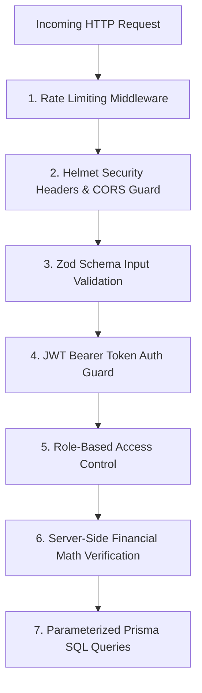

# Security & Financial Integrity Policy — 1Fi Marketplace

## 1. Security Architecture & Defense-in-Depth

The **1Fi Marketplace** enforces multiple layers of security to safeguard user data, prevent administrative privilege escalation, protect against common web vulnerabilities, and eliminate financial math manipulation during EMI application submissions.



---

## 2. Authentication & Authorization Controls

### 2.1 Password Security & Hashing
- Administrative passwords are salted and hashed using `bcryptjs` with a work factor (cost) of `12`.
- Plaintext passwords are **NEVER** logged, stored in memory beyond authentication duration, or returned in API payloads.

### 2.2 JWT Token Architecture
- Admin authentication generates stateless JSON Web Tokens (JWT) signed with a strong secret key (`JWT_SECRET`).
- Token payload contains: `{ id: adminUserId, email: string, role: AdminRole, iat: number, exp: number }`.
- Default Token Expiry: **8 hours**.
- Token transmission via standard `Authorization: Bearer <token>` HTTP header.

### 2.3 Role-Based Authorization Guards (RBAC)
- Admin routes are wrapped in an `authorizeRoles(...)` middleware:
  - `SUPER_ADMIN`: Full access to product management, plan management, application approval, and audit logs.
  - `CATALOG_MANAGER`: Access to products and variants only.
  - `FINANCE_OFFICER`: Access to EMI plans and application status updates only.

---

## 3. Financial Integrity & Zero-Trust Client Model

### The Problem: Financial Math Tampering
In naive implementations, clients compute interest, tenure, or monthly payments and transmit them to the backend:
```json
// DANGEROUS CLIENT PAYLOAD
{
  "variantId": "var_101",
  "monthlyInstallment": 1.00,  // <-- TAMPERED BY ATTACKER
  "interestRate": 0.00
}
```

### The 1Fi Solution: Authoritative Server Calculation Workflow
1. The client sends **ONLY** identifiers and personal details:
   ```json
   {
     "variantId": "var_101",
     "emiPlanId": "plan_301",
     "customerName": "Rohan Sharma",
     "customerEmail": "rohan@example.com",
     "customerPhone": "+919876543210",
     "panNumber": "ABCDE1234F"
   }
   ```
2. The backend service loads the authoritative `ProductVariant` record (verifying `price` and stock).
3. The backend service loads the authoritative `EMIPlan` record (verifying `isActive = true` and `variantId` linkage match).
4. The server executes financial math using exact standard formulas:
   \[
   E = P \cdot r \cdot \frac{(1+r)^n}{(1+r)^n - 1}
   \]
   Where \(P\) = Net financed principal (`variant.price - emiPlan.cashbackAmount`), \(r\) = Monthly interest rate (`interestRate / 12 / 100`), \(n\) = Tenure months.
5. The computed installment, total interest, and total payable are written inside a single database transaction (`prisma.$transaction`).

---

## 4. Input Validation & Injection Mitigation

### 4.1 Zod Strict Payload Validation
- Every API endpoint receiving data (`POST`, `PUT`, `PATCH`, `QUERY`) enforces a compiled Zod schema.
- Excess fields are stripped automatically (`strip()`), preventing mass-assignment vulnerabilities.
- Format validations enforced: Email strings, Indian Phone regex (`^\+91[6-9]\d{9}$`), Indian PAN regex (`^[A-Z]{5}[0-9]{4}[A-Z]{1}$`).

### 4.2 SQL Injection Prevention
- All database operations execute through **Prisma ORM**, which utilizes parameterized queries under the hood.
- Direct string interpolation into raw SQL queries is strictly prohibited.

### 4.3 XSS & Header Hardening
- **Helmet.js** configures standard HTTP security headers:
  - `Strict-Transport-Security` (HSTS)
  - `X-Content-Type-Options: nosniff`
  - `X-Frame-Options: DENY` (Prevents clickjacking)
  - `Content-Security-Policy` (CSP)

---

## 5. CORS, Rate Limiting & Denial-of-Service Protection

### 5.1 CORS Configuration
- Strict origin whitelist matching `FRONTEND_URL` (e.g. `https://marketplace.1fi.in` or `http://localhost:5173`).
- Allowed Methods: `GET, POST, PUT, PATCH, DELETE, OPTIONS`.
- Allowed Headers: `Content-Type, Authorization, x-request-id`.

### 5.2 Rate Limiting Policy (`express-rate-limit`)
- **Public Read APIs** (`/api/v1/products`): 100 requests per 15 minutes per IP.
- **EMI Application Submissions** (`POST /api/v1/emi-applications`): 5 requests per 15 minutes per IP (Prevents loan submission spam).
- **Admin Auth Login** (`POST /api/v1/admin/auth/login`): 5 failed attempts per 15 minutes per IP (Prevents credential brute-forcing).

---

## 6. Secret Management & Production Hygiene

- Secrets (DB connection string, JWT secrets, CORS origins) managed exclusively via `.env` files.
- `.env` and `.env.local` files are explicitly excluded in `.gitignore`.
- An environment validator script (`src/config/env.ts`) executes at server startup, verifying all required environment variables exist and conform to format before accepting connections.
