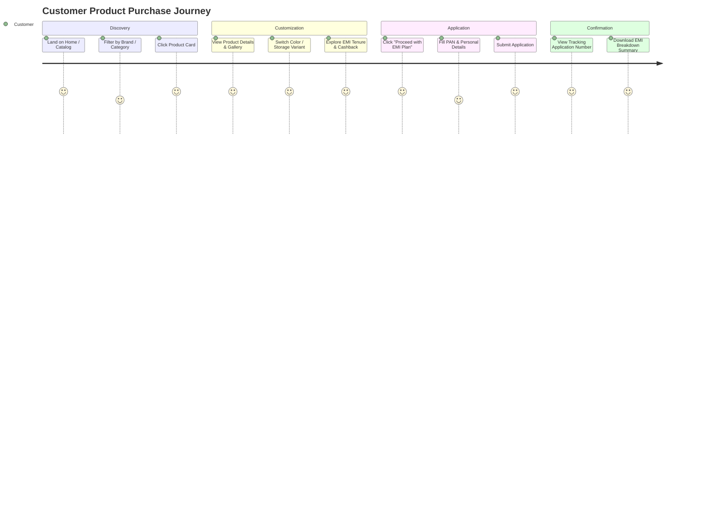

# User Experience & Design Architecture — 1Fi Marketplace

## 1. UX Vision & Visual Identity

**1Fi Marketplace** marries the clarity of premium e-commerce with the trust and transparency of modern fintech. Inspired by the information architecture of Snapmint's product detail view, 1Fi elevates the experience with its own distinct visual identity.

### Visual Design System Rules
- **Color Palette**: Modern slate dark foundation (`#0B0F17`, `#111827`), pristine crisp cards (`#1F2937` / `#FFFFFF`), and high-trust financial accents:
  - **1Fi Primary Accent**: Electric Indigo (`#6366F1`) & Emerald Green (`#10B981` for No-Cost EMI & cashback callouts).
- **Typography**: Google Font **Inter** or **Outfit** for clean numeric readability (essential for interest percentages and monthly EMI figures).
- **Surface & Elevation**: Subtle glassmorphic borders (`border-slate-800`), smooth shadow hover elevations, and dynamic pill highlights for selected variants.

---

## 2. Product Detail Information Architecture (PDP)

```
┌────────────────────────────────────────────────────────────────────────┐
│ [Header / Navbar] Logo | Catalog | Application Search | Admin Login    │
├────────────────────────────────────────────────────────────────────────┤
│ Breadcrumb: Home / Smartphones / Apple / iPhone 15 Pro                 │
├──────────────────────────────────┬─────────────────────────────────────┤
│                                  │ Product Title & Brand Badge         │
│ [Image Gallery]                  │ Rating (4.8 ★) | 128 Reviews        │
│ ┌──────────────────────────────┐ │ ─────────────────────────────────── │
│ │                              │ │ Price: ₹1,34,900  MRP: ₹1,44,900     │
│ │   [ Primary Product Image ]  │ │ Save 7% (₹10,000 Off)              │
│ │                              │ │ ─────────────────────────────────── │
│ └──────────────────────────────┘ │ Color Selector: [Natural] [Black]   │
│ [Thumb] [Thumb] [Thumb] [Thumb]  │ Storage Selector: [128GB] [256GB]   │
│                                  │ ─────────────────────────────────── │
│                                  │ EMI Offer Selector (Snapmint style) │
│                                  │ ┌─────────────────────────────────┐ │
│                                  │ │ [★ 24 Months] ₹5,495/mo (0% Cost) │ │
│                                  │ │ [  12 Months] ₹10,991/mo          │ │
│                                  │ └─────────────────────────────────┘ │
│                                  │ ⚡ Cashback: ₹3,000 Instant Disc.   │
│                                  │ 🏦 Partner: HDFC Bank Zero Down     │
│                                  │ ─────────────────────────────────── │
│                                  │ [  PROCEED WITH EMI PLAN - ₹5,495 ] │
├──────────────────────────────────┴─────────────────────────────────────┤
│ Product Specifications (Grouped Table) | Shipping & Warranty Badges    │
└────────────────────────────────────────────────────────────────────────┘
```

---

## 3. Core User Journeys

### 3.1 Customer Discovery to Checkout Journey



---

## 4. Comprehensive State Handling Strategy

To ensure zero interface flickering or broken UI, every data-driven component implements 4 explicit UI states:

| Component State | UI Representation | Interaction Behavior |
|---|---|---|
| **Loading State** | Custom animated Skeleton shapes matching exact component proportions | Controls disabled; prevents user action while fetching |
| **Success State** | Full interactive view with active variant selection & EMI preview widget | Instant reactive state updates upon user click |
| **Empty State** | Clean illustration with friendly copy (e.g., "No EMI plans currently available for this variant") | Actionable fallback button (e.g., "Select Different Variant") |
| **Error State** | Alert banner displaying human-readable domain error message | "Retry Request" button to refetch server state |
| **Submitting State** | Button displays inline spinner, text changes to "Processing Application...", input fields locked | Double-click prevention; user lock during API call |

---

## 5. Responsive Strategy & Accessibility

### Mobile Viewport Optimizations (< 768px)
- **Sticky Footer Bar**: As the user scrolls through product imagery and specifications, a sticky bottom bar pins the selected EMI monthly amount (`₹5,495/mo`) and the primary "Apply Now" button.
- **EMI Selection Drawer**: Clicking EMI options on mobile opens a bottom sheet drawer for easy thumb interaction.

### Accessibility (a11y) Standards
- Keyboard navigation supported across all interactive elements (`Tab` focus traps inside modals).
- ARIA labels attached to color swatch buttons (`aria-label="Select Natural Titanium color"`).
- Color contrast compliant with WCAG AA standards (minimum 4.5:1 contrast ratio for financial text).
